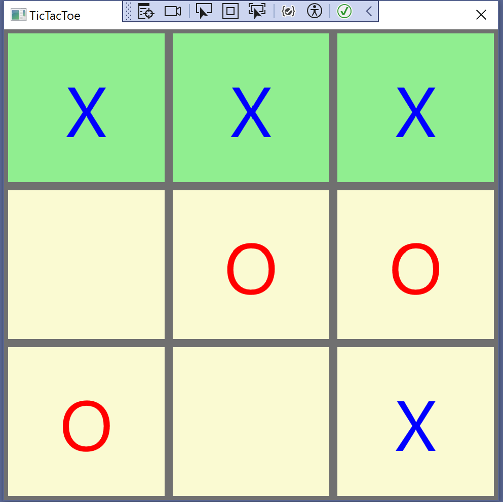

# Tic-Tac-Toe Game

A simple implementation of the classic Tic-Tac-Toe game using C# and WPF.

## Features

- 3x3 grid for gameplay
- Two-player mode (Player 1: X, Player 2: O)
- Win condition detection (horizontal, vertical, and diagonal)
- Game restart option
- Visual feedback for winning moves and draw (tie) games

## How to Play

1. Download or clone the repository to your local machine.
2. Open the project in Visual Studio or your preferred C# development environment.
3. Build and run the project.
4. Click on the cells of the grid to make your moves.
5. The game will announce the winner or declare a draw when the game ends.
6. Click the "New Game" button to start a new round.
